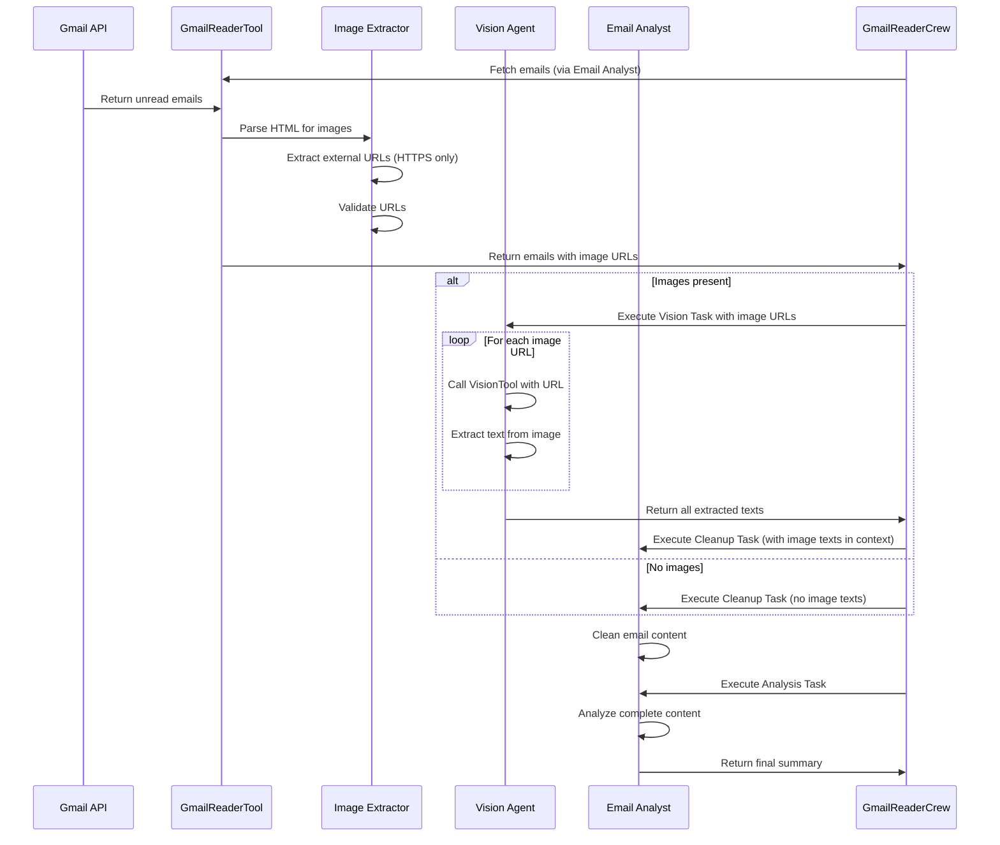

# Design Document: Image Text Extraction

## Overview

This feature enhances the Briefler email analysis system by adding the capability to extract text from images embedded in HTML emails. Currently, the system only processes text directly available in HTML, missing valuable information contained in images. This enhancement integrates a Vision Agent using CrewAI's Vision Tool to extract text from images before passing content to the analysis pipeline.

The solution leverages CrewAI's built-in Vision Tool, which uses LLM vision capabilities (e.g., GPT-4 Vision) to analyze images and extract text content. This approach provides high-quality text extraction without requiring separate OCR infrastructure.

## Architecture

### High-Level Flow

```
Gmail API → GmailReaderTool (Image Detection) → Vision Agent (Vision Tool) → Email Analyst (Cleanup & Analysis)
```

### Component Integration

The feature integrates into the existing GmailReaderCrew workflow:

1. **GmailReaderTool** (modified): Fetches emails and identifies images, prepares image URLs/paths
2. **Image Extractor Module** (new): Helper module for parsing HTML and preparing images
3. **Vision Agent** (new): CrewAI agent with Vision Tool for text extraction
4. **Vision Task** (new): CrewAI task for processing images (runs first if images present)
5. **Email Analyst** (existing): Cleans and analyzes content including extracted image texts
6. **Task Context** (CrewAI feature): Automatically passes Vision Task output to subsequent tasks

### Execution Flow



## Components and Interfaces

### 1. Image Extractor Module

**Location**: `src/briefler/tools/image_extractor.py`

**Purpose**: Identifies and downloads images from email HTML content.

**Key Methods** (MVP - External URLs Only):

```python
class ImageExtractor:
    def extract_images_from_html(self, html_content: str, message_id: str) -> List[ImageReference]:
        """
        Parse HTML to identify external image URLs (MVP: External URLs only).
        
        Process:
        1. Parse HTML to find  tags
        2. Extract src attributes
        3. Filter for HTTPS URLs only
        4. Validate URLs (format, optional domain whitelist)
        5. Create ImageReference objects with sequential indexing
        
        Args:
            html_content: HTML email content
            message_id: Gmail message ID for context
            
        Returns:
            List of ImageReference objects with external URLs
        """
        
    def validate_external_url(self, url: str) -> bool:
        """
        Validate external URL for security and format.
        
        Validation rules:
        1. Must use HTTPS protocol (reject HTTP)
        2. Must be a valid URL format
        3. If IMAGE_ALLOWED_DOMAINS is set, check domain whitelist
        4. If whitelist not set, allow all HTTPS URLs
        
        Args:
            url: Image URL to validate
            
        Returns:
            True if URL is valid and allowed, False otherwise
        """
        
    def get_domain_from_url(self, url: str) -> Optional[str]:
        """
        Extract domain from URL for whitelist checking.
        
        Args:
            url: Image URL
            
        Returns:
            Domain name or None if invalid URL
        """
```

**Simplified Approach**:
- No downloading or saving files (external URLs passed directly to VisionTool)
- No Gmail API attachment fetching
- No base64 decoding
- Focus on validation and URL extraction only

**Data Models**:

```python
class ImageReference(BaseModel):
    """Reference to an image in email content (MVP: External URLs only)."""
    message_id: str
    image_index: int  # Sequential index (1, 2, 3...) for identification
    external_url: str  # HTTPS URL to the image
```

**MVP Scope - External URLs Only**:

For the initial implementation, we focus exclusively on external URLs (https://...) because:

1. **Coverage**: ~95% of promotional/marketing emails use external URLs for images
2. **Simplicity**: No need to download, save, or manage temporary files
3. **Performance**: Direct URL passing to VisionTool is faster
4. **Common Use Cases**: 
   - Newsletter banners with promotional text
   - Marketing emails with offer details
   - Bank notifications with transaction details
   - Event invitations with key information

**Future Enhancements** (not in MVP):
- **Gmail Attachments (CID)**: ~3-5% of emails, mostly corporate logos (low priority)
- **Base64 Inline**: <1% of emails, very rare in modern email clients (very low priority)

**Note on Image Position**:
We use `image_index` (sequential numbering) instead of HTML position because:
- The Vision Agent processes images separately from email body
- The Email Analyst receives both email text and extracted image texts via task context
- The LLM can understand the relationship between email content and image texts without exact positioning
- Sequential numbering (Image 1, Image 2, etc.) is sufficient for identification

### 2. Integration with GmailReaderCrew

**Location**: `src/briefler/crews/gmail_reader_crew/`

**Purpose**: Extend existing GmailReaderCrew with Vision Agent for image text extraction.

**Agent Configuration** (add to `config/agents.yaml`):

```yaml
image_text_extractor:
  role: >
    Image Text Extractor
  goal: >
    Extract only text content from images embedded in emails without describing visual elements
  backstory: >
    You are a specialized text extraction agent working as part of the email analysis team. 
    Your sole purpose is to identify and extract any text visible in images from emails. 
    You do not describe people, objects, colors, composition, or any visual elements. 
    You only output the text you see in the image, preserving its structure and 
    formatting as much as possible. If no text is visible, you return an empty response.
    You work before the email analyst to enrich email content with text from images.
```

**Task Configuration** (add to `config/tasks.yaml`):

```yaml
extract_text_from_images:
  description: >
    The email content contains {image_count} image(s). You must process EACH image separately 
    using the VisionTool to extract ONLY the text content visible in each image.
    
    Images to process:
    {image_list}
    
    CRITICAL RULES:
    - Use VisionTool for EACH image URL/path listed above
    - Extract only text characters, words, and sentences visible in each image
    - Preserve line breaks and paragraph structure where visible
    - Do NOT describe what the image shows (people, objects, colors, layout)
    - Do NOT provide context or interpretation
    - If no text is visible in an image, note "No text found" for that image
    - If text is partially obscured or unclear, extract what is legible
    - Process ALL images in the list, one by one
    
    For each image, output the extracted text with a clear marker indicating which image it came from.
    
  expected_output: >
    For each image in the list, provide:
    
    [Image 1: <url_or_path>]
    <extracted_text_or_"No text found">
    
    [Image 2: <url_or_path>]
    <extracted_text_or_"No text found">
    
    ...and so on for all images.
    
    If no images contain text, return "No text found in any images."
  agent: image_text_extractor
```

**Crew Implementation** (modify `gmail_reader_crew.py`):

```python
from typing import List
from crewai import Agent, Crew, Process, Task
from crewai.agents.agent_builder.base_agent import BaseAgent
from crewai.project import CrewBase, agent, crew, task
from crewai_tools import VisionTool
from briefler.tools.gmail_reader_tool import GmailReaderTool


@CrewBase
class GmailReaderCrew:
    """Gmail Reader Crew for analyzing unread emails with image text extraction"""

    agents: List[BaseAgent]
    tasks: List[Task]

    agents_config = "config/agents.yaml"
    tasks_config = "config/tasks.yaml"

    @agent
    def image_text_extractor(self) -> Agent:
        """Agent for extracting text from images in emails"""
        vision_tool = VisionTool()
        return Agent(
            config=self.agents_config["image_text_extractor"],
            tools=[vision_tool],
        )

    @agent
    def email_analyst(self) -> Agent:
        gmail_tool = GmailReaderTool()
        return Agent(
            config=self.agents_config["email_analyst"],
            tools=[gmail_tool],
        )

    @task
    def extract_text_from_images(self) -> Task:
        """Task to extract text from images in emails"""
        return Task(
            config=self.tasks_config["extract_text_from_images"],
        )

    @task
    def cleanup_email_content(self) -> Task:
        """Task to clean email content by removing boilerplate"""
        return Task(
            config=self.tasks_config["cleanup_email_content"],
        )

    @task
    def analyze_emails(self) -> Task:
        """Task to analyze cleaned email content and generate summary"""
        return Task(
            config=self.tasks_config["analyze_emails"],
        )

    @crew
    def crew(self) -> Crew:
        """Creates the Gmail Reader Crew with image processing"""
        return Crew(
            agents=self.agents,
            tasks=self.tasks,
            process=Process.sequential,
            verbose=True,
        )
```

**Task Flow**:

The crew will execute tasks in this order:
1. **extract_text_from_images** (if images present) - Vision Agent extracts text from images
2. **cleanup_email_content** - Email Analyst cleans email content (now includes image texts)
3. **analyze_emails** - Email Analyst analyzes complete content

**Usage Pattern** (MVP - External URLs Only):

The VisionTool accepts `image_path_url` parameter with external HTTPS URLs:
- Examples: 
  - `https://googleusercontent.com/meips/...=s0-d-e1-ft#https://image.info.ocbc.id/...`
  - `https://cdn.example.com/newsletter/banner.png`
  - `https://example.com/image?id=123&size=large`
- Domain and file extension can vary
- Must use HTTPS protocol for security

The agent automatically calls VisionTool when it sees image URLs in the task description.

**Future Enhancement**: Support for Gmail attachments (CID) and base64 inline images can be added later if needed.

### 4. Flow Integration

**Location**: `src/briefler/flows/gmail_read_flow/gmail_read_flow.py`

**Purpose**: Modify flow to pass image URLs to crew.

**Modified Method**:

```python
class GmailReadFlow(Flow[FlowState]):
    # ... existing code ...
    
    @listen(initialize)
    def analyze_emails(self):
        """
        Execute Gmail Reader Crew with enhanced parameters (MODIFIED).
        
        The crew will automatically handle image processing if images are present.
        """
        print(f"Analyzing emails from {len(self.state.sender_emails)} sender(s)...")
        print(f"Language: {self.state.language}, Days: {self.state.days}")
        
        # Prepare crew_inputs dictionary
        crew_inputs = {
            'sender_emails': self.state.sender_emails,
            'language': self.state.language,
            'days': self.state.days
        }
        
        # Note: GmailReaderTool will extract emails and identify images.
        # The formatted output will include image URLs/paths in a structured format.
        # The Vision Agent will process ALL images found, one by one.
        
        # Instantiate GmailReaderCrew and call crew().kickoff(inputs=crew_inputs)
        result = GmailReaderCrew().crew().kickoff(inputs=crew_inputs)
        
        # Store result.raw in self.state.result
        self.state.result = result.raw
```

**Task Execution Flow**:

1. **GmailReaderTool** (via Email Analyst):
   - Fetches emails from Gmail API
   - Parses HTML to identify images
   - Prepares image URLs/paths (external URLs directly, attachments saved to temp files)
   - Returns formatted output with `IMAGES_FOR_PROCESSING` section

2. **extract_text_from_images** task (Vision Agent):
   - Receives formatted output with image list
   - For EACH image in the list:
     - Calls VisionTool with image URL/path
     - Extracts text content
   - Returns structured output with text for each image

3. **cleanup_email_content** task (Email Analyst):
   - Receives original email content + extracted image texts (via task context)
   - Cleans boilerplate from email content
   - Preserves extracted image texts

4. **analyze_emails** task (Email Analyst):
   - Receives cleaned content including image texts
   - Analyzes complete content
   - Generates summary in specified language

**Key Point**: The Vision Agent will automatically call VisionTool multiple times (once per image) because the task description explicitly instructs it to "process EACH image separately".

### 3. Modified GmailReaderTool

**Location**: `src/briefler/tools/gmail_reader_tool.py`

**Purpose**: Extend GmailReaderTool to identify images and prepare them for Vision Agent.

**Modified Methods**:

```python
class GmailReaderTool(BaseTool):
    # ... existing code ...
    
    def _extract_message_data(self, message: dict) -> dict:
        """
        Extract structured data from a Gmail message (EXISTING METHOD - MODIFIED).
        
        Now also extracts image references from HTML content.
        
        Returns:
            Dictionary with additional 'image_urls' field containing list of image URLs/paths
        """
        
    def _extract_images_from_html(self, html_content: str, message_id: str) -> List[str]:
        """
        Extract image URLs from HTML content (NEW METHOD).
        
        Process:
        1. Parse HTML to find  tags
        2. Extract src attributes
        3. For external URLs: validate against whitelist and return URL
        4. For CID references: download from Gmail and save to temp file, return path
        5. For base64 inline: decode and save to temp file, return path
        
        Args:
            html_content: HTML email content
            message_id: Gmail message ID
            
        Returns:
            List of image URLs or local file paths ready for VisionTool
        """
        
    def _format_output(self, messages: list, sender_emails: List[str], days: int) -> str:
        """
        Format message list into readable string output (EXISTING METHOD - MODIFIED).
        
        Now includes image URLs in the output for Vision Agent to process.
        
        Returns:
            Formatted string with image URLs included for each message
        """
```

**Output Format Change**:

The formatted output will now include image information for the Vision Agent:

```
---
Message 1:
Subject: Monthly Newsletter
From: sender@example.com
Date: 2025-11-13

<email body content>

Attachments: 1 file
- document.pdf (application/pdf, 1024 bytes)

---
IMAGES_FOR_PROCESSING: 2
IMAGE_1: https://googleusercontent.com/.../image1.jpg
IMAGE_2: /tmp/email_images/msg_123_img_2.jpg
```

**How Image Texts are Integrated**:

1. **Vision Agent** processes images and returns:
   ```
   [Image 1: https://googleusercontent.com/.../image1.jpg]
   Special Offer: 50% Off This Week!
   Use code: SAVE50
   
   [Image 2: /tmp/email_images/msg_123_img_2.jpg]
   Contact us: support@example.com
   ```

2. **Email Analyst** receives via task context:
   - Original email body (plain text)
   - Extracted image texts (from Vision Agent)
   
3. **Email Analyst** analyzes both together without needing exact positioning:
   - The LLM understands the relationship between email content and image texts
   - Sequential numbering (Image 1, Image 2) provides sufficient identification
   - The analyst can reference "text from Image 1" in the summary if needed

## Data Models

### Core Data Structures

```python
# Image Reference
class ImageReference(BaseModel):
    message_id: str
    attachment_id: Optional[str] = None
    inline_data: Optional[str] = None
    content_id: Optional[str] = None
    src_url: Optional[str] = None
    position: int
    format: str

# Extracted Text
class ExtractedText(BaseModel):
    image_ref: ImageReference
    text: str
    confidence: Optional[float] = None
    processing_time: float
    error: Optional[str] = None

# Processing Metrics
class ImageProcessingMetrics(BaseModel):
    total_images: int = 0
    processed_images: int = 0
    failed_images: int = 0
    total_processing_time: float = 0.0
    texts_extracted: int = 0
```

### Message Data Extension

The existing message data structure will be extended:

```python
{
    "id": str,
    "thread_id": str,
    "snippet": str,
    "subject": str,
    "from": str,
    "date": str,
    "body": str,
    "attachments": [],
    "image_urls": List[str]  # New field: URLs or local paths for Vision Agent
}
```

The formatted output string will include image URLs for the Vision Agent to process.

## Error Handling

### Error Categories and Responses

1. **Image Download Failures**
   - Log error with message ID and image reference
   - Continue processing other images
   - Include failure in metrics

2. **Vision Agent Failures**
   - Retry once with exponential backoff
   - Log error with image details
   - Continue with remaining images
   - Mark as failed in metrics

3. **Timeout Handling**
   - Single image timeout: 10 seconds
   - Total processing timeout per email: 60 seconds
   - Return partial results if timeout exceeded

4. **Invalid Image Formats**
   - Validate format before processing
   - Skip unsupported formats
   - Log warning with format details

5. **Size Limit Exceeded**
   - Check size before download
   - Skip images > 10 MB
   - Log warning with size information

### Error Logging Structure

```python
logger.error(
    "Image processing failed",
    extra={
        "message_id": message_id,
        "image_position": position,
        "error_type": error_type,
        "error_message": str(error),
        "retry_count": retry_count
    },
    exc_info=True
)
```

## Testing Strategy

### Unit Tests

1. **Image Extractor Tests** (`tests/tools/test_image_extractor.py`)
   - Test HTML parsing for various image formats
   - Test external URL extraction and validation
   - Test CID reference extraction
   - Test base64 inline image extraction
   - Test image preparation for VisionTool
   - Test error handling for malformed HTML

2. **GmailReaderCrew Tests** (`tests/crews/test_gmail_reader_crew.py`)
   - Test Vision Agent initialization
   - Test Vision Task execution with sample images
   - Test text-only extraction (no descriptions)
   - Test empty response for images without text
   - Test task context passing between Vision Task and Cleanup Task
   - Mock Vision Tool for deterministic testing

3. **GmailReaderTool Tests** (`tests/tools/test_gmail_reader_tool.py`)
   - Test image URL extraction from formatted output
   - Test handling of emails with and without images
   - Test integration with Image Extractor module

### Integration Tests

1. **End-to-End Image Processing** (`tests/integration/test_image_processing.py`)
   - Test complete flow from email to aggregated content
   - Test with real sample emails containing images
   - Test with various image formats and sizes
   - Test error recovery and partial results

2. **Gmail API Integration** (`tests/integration/test_gmail_images.py`)
   - Test image download from Gmail attachments
   - Test inline image extraction
   - Test with real Gmail API responses (mocked)

### Test Data

Create test fixtures:
- Sample HTML emails with various image types
- Sample images with text (invoices, screenshots, flyers)
- Sample images without text (photos, logos)
- Malformed images for error testing

## Performance Considerations

### Optimization Strategies

1. **Caching**
   - Cache extracted texts by image URL hash for 24 hours
   - Avoid reprocessing identical images across emails
   - Use file-based cache (simple implementation)

2. **Sequential Processing**
   - Vision Agent processes images sequentially (one VisionTool call per image)
   - This is the default CrewAI behavior and ensures reliability
   - No need for complex parallel processing logic

3. **Resource Limits**
   - Limit to 5 images per email (configurable)
   - Skip images > 10 MB
   - Total timeout: 60 seconds per email (handled by CrewAI task timeout)
   - Skip external URLs from untrusted domains

4. **Vision Tool Optimization**
   - VisionTool handles image processing internally
   - Monitor token usage for LLM calls (each image = 1 VisionTool call)
   - Consider cost implications for emails with many images

### Performance Metrics

Track and log:
- Average processing time per image
- Success rate of text extraction
- Cache hit rate
- Total processing time per email
- LLM token usage

## Configuration

### Environment Variables

Add to `.env`:

```bash
# Image Processing Configuration
IMAGE_PROCESSING_ENABLED=true
IMAGE_MAX_SIZE_MB=10
IMAGE_PROCESSING_TIMEOUT=60
IMAGE_MAX_PER_EMAIL=5
IMAGE_CACHE_TTL=86400  # 24 hours in seconds
IMAGE_DOWNLOAD_TIMEOUT=5  # HTTP request timeout in seconds

# External URL Validation (optional - for security)
# If set, only images from these domains will be processed
# If not set, all HTTPS URLs are allowed
# IMAGE_ALLOWED_DOMAINS=googleusercontent.com,gstatic.com,cdn.example.com

# Vision Tool Configuration
VISION_MODEL=gpt-4-vision-preview  # or other vision-capable model
VISION_MAX_TOKENS=500
VISION_TEMPERATURE=0.0  # Deterministic for text extraction
```

### Feature Flag

Implement feature flag to enable/disable image processing:

```python
def should_process_images() -> bool:
    """Check if image processing is enabled."""
    return os.getenv('IMAGE_PROCESSING_ENABLED', 'false').lower() == 'true'
```

## Security Considerations

1. **Image Source Validation**
   - **External URLs**: 
     - Require HTTPS protocol (reject HTTP for security)
     - Optional domain whitelist (if `IMAGE_ALLOWED_DOMAINS` is set)
     - If whitelist not configured, allow all HTTPS URLs
     - Validate URL format before processing
   - **Gmail Attachments**: Already trusted (from Gmail API)
   - **Base64 Inline**: Validate data URI format and size
   - Log all processed image URLs for audit purposes

2. **HTTP Request Safety**
   - Set reasonable timeout (5 seconds) for external downloads
   - Limit redirect following (max 2 redirects)
   - Validate Content-Type header matches image format
   - Check Content-Length before downloading
   - Use User-Agent header to identify requests

3. **Data Privacy**
   - Do not store image data permanently
   - Clear image cache after TTL expires
   - Log only metadata, not image content
   - Do not log external URLs in full (sanitize query params)

4. **Resource Protection**
   - Enforce size limits to prevent memory exhaustion
   - Enforce timeout limits to prevent hanging processes
   - Rate limit Vision Tool calls if needed
   - Limit concurrent HTTP requests (max 3)

## Migration and Rollout

### Phase 1: Core Implementation
- Implement Image Extractor module
- Implement Vision Crew with Vision Tool
- Implement Content Aggregator module
- Add unit tests

### Phase 2: Integration
- Integrate with GmailReaderTool
- Add feature flag
- Add configuration options
- Add integration tests

### Phase 3: Testing and Optimization
- Test with real emails
- Optimize performance
- Add caching
- Monitor metrics

### Phase 4: Deployment
- Enable feature flag in production
- Monitor error rates and performance
- Gather user feedback
- Iterate on improvements

## Dependencies

### New Dependencies

Add to `pyproject.toml`:

```toml
[project]
dependencies = [
    # ... existing dependencies ...
    "pillow>=10.0.0",  # Image validation and processing
    "aiohttp>=3.9.0",  # Async HTTP for parallel downloads
]
```

### CrewAI Vision Tool

The Vision Tool is built into CrewAI and requires:
- OpenAI API key (already configured)
- Vision-capable model (e.g., gpt-4-vision-preview)
- No additional installation required

## Monitoring and Observability

### Metrics to Track

1. **Processing Metrics**
   - Images processed per email
   - Success/failure rates
   - Average processing time
   - Cache hit rates

2. **Quality Metrics**
   - Text extraction success rate
   - Empty extraction rate
   - Error rate by error type

3. **Resource Metrics**
   - LLM token usage
   - Memory usage
   - API call counts

### Logging Strategy

```python
# Success logging
logger.info(
    "Image text extraction completed",
    extra={
        "message_id": message_id,
        "images_processed": metrics.processed_images,
        "texts_extracted": metrics.texts_extracted,
        "total_time": metrics.total_processing_time
    }
)

# Error logging
logger.error(
    "Image processing failed",
    extra={
        "message_id": message_id,
        "error_type": error_type,
        "retry_count": retry_count
    },
    exc_info=True
)
```

## Future Enhancements

1. **Multi-language OCR**: Support for non-Latin scripts
2. **Table Extraction**: Specialized handling for tables in images
3. **Handwriting Recognition**: Extract handwritten text
4. **Image Classification**: Categorize images before processing
5. **Confidence Scoring**: Provide confidence scores for extracted text
6. **Alternative OCR Engines**: Support for Tesseract or cloud OCR services
